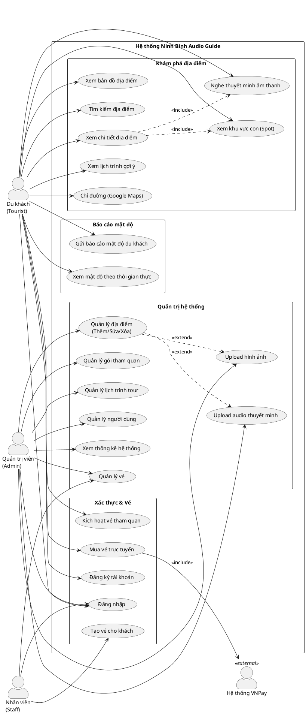
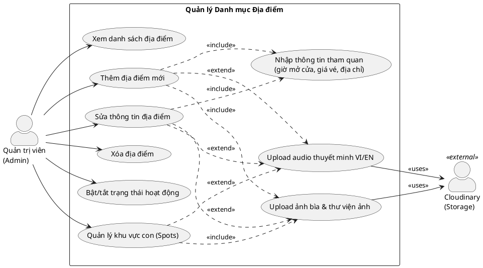
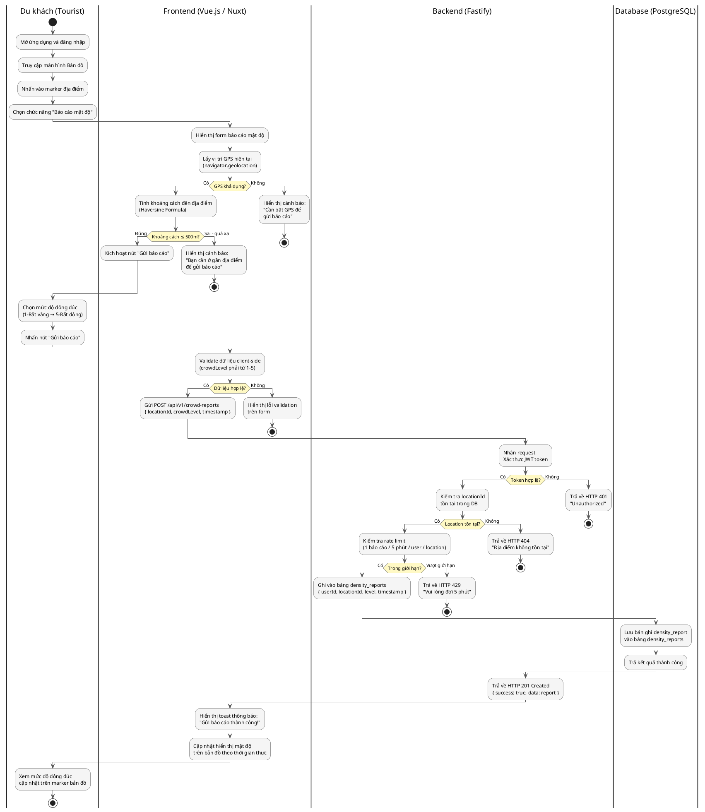
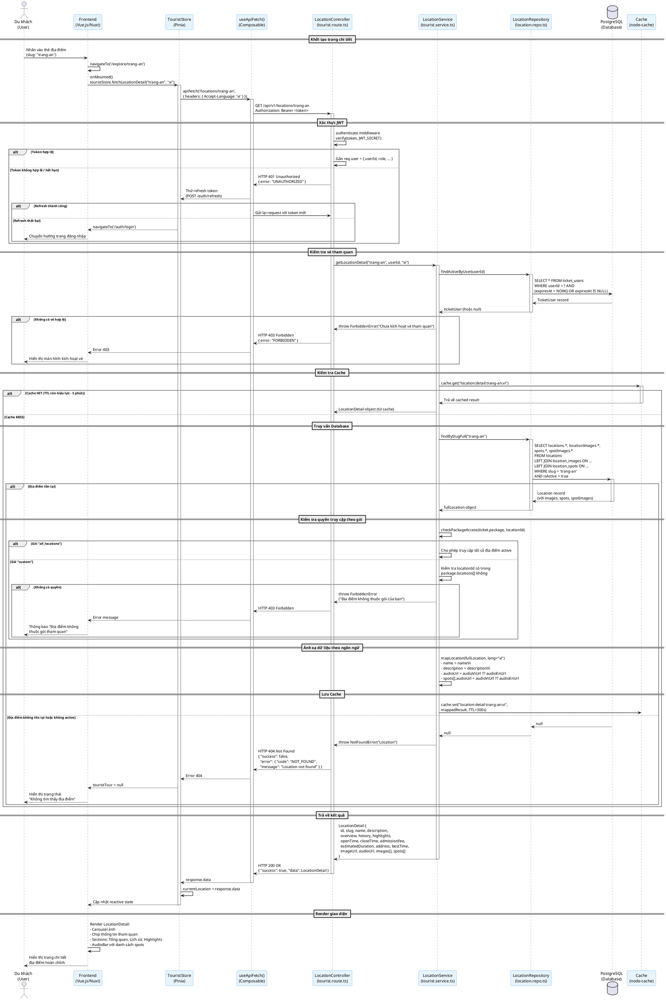

# CHƯƠNG 2: PHÂN TÍCH VÀ THIẾT KẾ HỆ THỐNG

---

## 2.1. Sơ đồ Use Case và Đặc tả kịch bản ngoại lệ

### 2.1.1. Sơ đồ Use Case tổng quan

Hệ thống **Ninh Bình Audio Guide** xác định ba tác nhân chính: **Du khách (Tourist)**, **Nhân viên quầy vé (Staff)** và **Quản trị viên (Admin)**. Mỗi tác nhân tương tác với hệ thống qua tập hợp các ca sử dụng đặc trưng, được mô tả trong sơ đồ dưới đây.

> [CHÈN ẢNH SƠ ĐỒ GEN TỪ MÃ PLANTUML PHÍA DƯỚI]



---

### 2.1.2. Sơ đồ Use Case chi tiết — Nhóm chức năng Quản lý địa điểm (Admin)

> [CHÈN ẢNH SƠ ĐỒ GEN TỪ MÃ PLANTUML PHÍA DƯỚI]



---

### 2.1.3. Đặc tả kịch bản ngoại lệ (Edge Cases)

#### Kịch bản 1: Du khách gửi báo cáo mật độ tại địa điểm không tồn tại hoặc sai tọa độ

| Thuộc tính | Mô tả |
|---|---|
| **Tên ca sử dụng** | Gửi báo cáo mật độ du khách |
| **Tác nhân** | Du khách (Tourist) |
| **Điều kiện tiên quyết** | Người dùng đã đăng nhập và có vé còn hiệu lực |
| **Luồng bình thường** | Người dùng chọn địa điểm → nhập mức độ đông đúc → hệ thống lưu và xác nhận |

**Kịch bản ngoại lệ E1.1 — `locationId` không tồn tại trong cơ sở dữ liệu:**

```
1. Người dùng gửi POST /api/v1/crowd-reports với { locationId: "id_khong_ton_tai", level: 3 }
2. Server thực thi locationRepo.findById(locationId)
3. Truy vấn trả về null
4. Service ném NotFoundError("Location")
5. Global error handler trả về:
   HTTP 404 Not Found
   { "success": false, "error": { "code": "NOT_FOUND", "message": "Location not found" } }
6. Frontend hiển thị toast: "Địa điểm không tồn tại. Vui lòng thử lại."
```

**Kịch bản ngoại lệ E1.2 — Tọa độ báo cáo lệch quá xa địa điểm (> 500m):**

```
1. Người dùng gửi báo cáo với GPS hiện tại cách địa điểm 2km
2. Server tính khoảng cách Haversine giữa tọa độ user và địa điểm
3. Khoảng cách > ngưỡng cho phép (500m)
4. Server trả về:
   HTTP 422 Unprocessable Entity
   { "success": false, "error": { "code": "LOCATION_TOO_FAR",
     "message": "Bạn cần ở gần địa điểm để gửi báo cáo (tối đa 500m)" } }
5. Frontend hiển thị thông báo và đề xuất kiểm tra lại GPS
```

**Kịch bản ngoại lệ E1.3 — Gửi báo cáo trùng lặp trong khoảng thời gian ngắn:**

```
1. Người dùng gửi báo cáo hai lần liên tiếp trong vòng 5 phút
2. Hệ thống kiểm tra bảng density_reports: tồn tại bản ghi cùng userId + locationId
   trong khoảng thời gian < 5 phút
3. Server trả về:
   HTTP 429 Too Many Requests
   { "success": false, "error": { "code": "REPORT_COOLDOWN",
     "message": "Vui lòng đợi 5 phút trước khi gửi báo cáo tiếp theo" } }
```

---

#### Kịch bản 2: Hệ thống không tải được file Audio (lỗi server/đường dẫn)

| Thuộc tính | Mô tả |
|---|---|
| **Tên ca sử dụng** | Nghe thuyết minh âm thanh |
| **Tác nhân** | Du khách (Tourist) |
| **Điều kiện tiên quyết** | Du khách đang xem trang chi tiết địa điểm |

**Kịch bản ngoại lệ E2.1 — URL audio trả về HTTP 404 từ Cloudinary:**

```
1. Frontend gọi AudioBar component với src = "https://cloudinary.com/.../audio.mp3"
2. HTML Audio element phát hiện lỗi tải file (event: 'error')
3. AudioBar bắt sự kiện audio.addEventListener('error', handler)
4. Cập nhật UI: hiển thị chip "Không tải được audio"
5. Nút Play bị vô hiệu hóa (disabled)
6. Hiển thị thông báo: "Audio thuyết minh tạm thời không khả dụng"
7. Ghi log lỗi vào console (không crash ứng dụng)
```

**Kịch bản ngoại lệ E2.2 — audioUrl là null (chưa được upload):**

```
1. API trả về location.audioUrl = null
2. TouristLocationDetail.audioUrl = null
3. audioTracks computed: track với audioUrl = null vẫn được thêm vào danh sách
4. AudioBar kiểm tra activeTrack?.audioUrl === null
5. Hiển thị trạng thái "No audio" với chip màu xám và icon âm nhạc
6. Thông báo: "Chưa có audio thuyết minh cho khu vực này"
7. Chip bị disable, không thể click
```

**Kịch bản ngoại lệ E2.3 — Mạng ngắt kết nối trong khi đang phát:**

```
1. Audio đang phát, kết nối mạng bị gián đoạn
2. HTML Audio element phát sự kiện 'stalled' sau đó 'error'
3. AudioBar dừng animation và cập nhật isPlaying = false
4. Hiển thị icon cảnh báo kết nối
5. Tự động thử lại khi mạng khôi phục (sự kiện online của window)
```

---

#### Kịch bản 3: Admin nhập dữ liệu địa điểm thiếu trường bắt buộc

| Thuộc tính | Mô tả |
|---|---|
| **Tên ca sử dụng** | Thêm địa điểm mới |
| **Tác nhân** | Quản trị viên (Admin) |
| **Điều kiện tiên quyết** | Admin đã đăng nhập |

**Kịch bản ngoại lệ E3.1 — Thiếu Vĩ độ/Kinh độ:**

```
Frontend (client-side):
1. Admin nhấn "Lưu" khi latitude/longitude để trống
2. Hàm validate() kiểm tra: formData.latitude === null || formData.longitude === null
3. Hiển thị toast lỗi: "Vĩ độ / Kinh độ: Trường này là bắt buộc"
4. Request không được gửi lên server

Backend (server-side validation — lớp bảo vệ thứ hai):
5. Nếu request vẫn đến server (bypass frontend), Zod schema kiểm tra:
   CreateLocationSchema: latitude: z.number().min(-90).max(90)
6. safeParse() trả về { success: false, error: ZodError }
7. Server trả về:
   HTTP 422 Unprocessable Entity
   { "success": false, "error": { "code": "VALIDATION_ERROR",
     "details": { "fieldErrors": { "latitude": ["Required"],
                                   "longitude": ["Required"] } } } }
8. Frontend hiển thị lỗi chi tiết theo từng field
```

**Kịch bản ngoại lệ E3.2 — Slug đã tồn tại trong hệ thống:**

```
1. Admin nhập slug "trang-an" đã tồn tại
2. Server thực thi locationRepo.findBySlug("trang-an")
3. Tìm thấy bản ghi → ném ConflictError
4. Server trả về:
   HTTP 409 Conflict
   { "success": false, "error": { "code": "CONFLICT",
     "message": "Slug 'trang-an' already exists" } }
5. Frontend hiển thị toast lỗi tại field slug
6. Gợi ý: Admin nhấn "Tự tạo slug" để sinh slug duy nhất từ tên địa điểm
```

**Kịch bản ngoại lệ E3.3 — Tọa độ nằm ngoài giới hạn hợp lệ:**

```
1. Admin nhập latitude = 200 (ngoài khoảng [-90, 90])
2. Zod validation: z.number().min(-90).max(90) thất bại
3. Server trả về lỗi validation
4. Frontend hiển thị: "Vĩ độ phải trong khoảng -90 đến 90"
```

---

## 2.2. Sơ đồ luồng nghiệp vụ (Activity Diagram)

### 2.2.1. Luồng "Gửi báo cáo mật độ tại điểm đến"

Sơ đồ hoạt động mô tả chi tiết quy trình từ khi du khách khởi tạo báo cáo mật độ đến khi hệ thống xác nhận lưu trữ thành công, bao gồm các nhánh xử lý lỗi.

> [CHÈN ẢNH SƠ ĐỒ GEN TỪ MÃ PLANTUML PHÍA DƯỚI]



---

## 2.3. Sơ đồ tuần tự (Sequence Diagram)

### 2.3.1. Luồng "Truy vấn chi tiết địa điểm du lịch"

Sơ đồ tuần tự mô tả luồng tương tác theo chiều dọc thời gian giữa các thành phần hệ thống khi du khách truy cập trang chi tiết một địa điểm tham quan, bao gồm trường hợp thành công (HTTP 200) và thất bại (HTTP 404).

> [CHÈN ẢNH SƠ ĐỒ GEN TỪ MÃ PLANTUML PHÍA DƯỚI]



---

## 2.4. Thiết kế Cơ sở dữ liệu (Database Design)

### 2.4.1. Sơ đồ ERD (Entity Relationship Diagram)

> [CHÈN ẢNH SƠ ĐỒ GEN TỪ MÃ PLANTUML PHÍA DƯỚI]

```plantuml
@startuml ERD_NinhBinhGuide
!define TABLE(name,desc) class name as "desc" << (T,#FFAAAA) >>
!define PK(x) <u>x</u>
!define FK(x) #x
skinparam classBackgroundColor #FEFEFE
skinparam classBorderColor #AAAAAA
skinparam classArrowColor #555555
skinparam classFontSize 12

hide methods
hide stereotypes

entity users {
  * PK(id) : VARCHAR(36)
  --
  email : VARCHAR(255) <<UNIQUE, NULL>>
  phone : VARCHAR(20) <<UNIQUE, NULL>>
  passwordHash : TEXT <<NOT NULL>>
  name : VARCHAR(255) <<NOT NULL>>
  role : ENUM(admin,staff,tourist)
  createdAt : TIMESTAMP
  updatedAt : TIMESTAMP
}

entity refresh_tokens {
  * PK(id) : VARCHAR(36)
  --
  FK(userId) : VARCHAR(36) <<FK>>
  token : TEXT <<UNIQUE, NOT NULL>>
  expiresAt : TIMESTAMP <<NOT NULL>>
  createdAt : TIMESTAMP
}

entity categories {
  * PK(id) : VARCHAR(36)
  --
  nameVi : VARCHAR(100) <<NOT NULL>>
  nameEn : VARCHAR(100) <<NOT NULL>>
  slug : VARCHAR(100) <<UNIQUE, NOT NULL>>
  icon : VARCHAR(50)
  displayOrder : INT <<DEFAULT 0>>
  isActive : BOOLEAN <<DEFAULT true>>
  createdAt : TIMESTAMP
}

entity locations {
  * PK(id) : VARCHAR(36)
  --
  FK(categoryId) : VARCHAR(36) <<FK, NULL>>
  slug : VARCHAR(255) <<UNIQUE, NOT NULL>>
  nameVi : VARCHAR(500) <<NOT NULL>>
  nameEn : VARCHAR(500) <<NOT NULL>>
  descriptionVi : TEXT
  descriptionEn : TEXT
  overviewVi : TEXT
  overviewEn : TEXT
  historyVi : TEXT
  historyEn : TEXT
  highlightsVi : TEXT
  highlightsEn : TEXT
  openTime : VARCHAR(50)
  closeTime : VARCHAR(50)
  admissionFee : INT <<DEFAULT 0>>
  estimatedDuration : INT
  address : VARCHAR(500)
  bestTime : VARCHAR(255)
  latitude : FLOAT <<NOT NULL>>
  longitude : FLOAT <<NOT NULL>>
  imageUrl : TEXT
  audioViUrl : TEXT
  audioEnUrl : TEXT
  displayOrder : INT <<DEFAULT 0>>
  isActive : BOOLEAN <<DEFAULT true>>
  createdAt : TIMESTAMP
  updatedAt : TIMESTAMP
}

entity location_images {
  * PK(id) : VARCHAR(36)
  --
  FK(locationId) : VARCHAR(36) <<FK>>
  url : TEXT <<NOT NULL>>
  caption : VARCHAR(500)
  "order" : INT <<DEFAULT 0>>
  createdAt : TIMESTAMP
}

entity location_spots {
  * PK(id) : VARCHAR(36)
  --
  FK(locationId) : VARCHAR(36) <<FK>>
  nameVi : VARCHAR(500) <<NOT NULL>>
  nameEn : VARCHAR(500) <<NOT NULL>>
  descriptionVi : TEXT
  descriptionEn : TEXT
  audioViUrl : TEXT
  audioEnUrl : TEXT
  latitude : FLOAT
  longitude : FLOAT
  "order" : INT <<DEFAULT 0>>
  createdAt : TIMESTAMP
  updatedAt : TIMESTAMP
}

entity location_spot_images {
  * PK(id) : VARCHAR(36)
  --
  FK(spotId) : VARCHAR(36) <<FK>>
  url : TEXT <<NOT NULL>>
  "order" : INT <<DEFAULT 0>>
  createdAt : TIMESTAMP
}

entity packages {
  * PK(id) : VARCHAR(36)
  --
  name : VARCHAR(500) <<NOT NULL>>
  description : TEXT
  type : ENUM(all_locations,custom)
  validityHours : INT <<DEFAULT 24>>
  price : INT <<DEFAULT 0>>
  isActive : BOOLEAN <<DEFAULT true>>
  createdAt : TIMESTAMP
  updatedAt : TIMESTAMP
}

entity package_locations {
  * PK(packageId,locationId)
  --
  FK(packageId) : VARCHAR(36) <<FK>>
  FK(locationId) : VARCHAR(36) <<FK>>
  "order" : INT <<DEFAULT 0>>
}

entity tickets {
  * PK(id) : VARCHAR(36)
  --
  code : VARCHAR(20) <<UNIQUE, NOT NULL>>
  FK(packageId) : VARCHAR(36) <<FK>>
  FK(createdById) : VARCHAR(36) <<FK>>
  guestName : VARCHAR(255) <<NOT NULL>>
  guestPhone : VARCHAR(20)
  note : TEXT
  expiresAt : TIMESTAMP <<NOT NULL>>
  isPaid : BOOLEAN <<DEFAULT false>>
  amountCollected : INT <<DEFAULT 0>>
  isCancelled : BOOLEAN <<DEFAULT false>>
  cancelledAt : TIMESTAMP
  createdAt : TIMESTAMP
}

entity ticket_users {
  * PK(id) : VARCHAR(36)
  --
  FK(ticketId) : VARCHAR(36) <<FK>>
  FK(userId) : VARCHAR(36) <<FK>>
  activatedAt : TIMESTAMP
  expiresAt : TIMESTAMP
}

entity tours {
  * PK(id) : VARCHAR(36)
  --
  nameVi : VARCHAR(500) <<NOT NULL>>
  nameEn : VARCHAR(500) <<NOT NULL>>
  duration : VARCHAR(100) <<NOT NULL>>
  badgeVi : VARCHAR(100)
  badgeEn : VARCHAR(100)
  noteVi : TEXT
  noteEn : TEXT
  isActive : BOOLEAN <<DEFAULT true>>
  displayOrder : INT <<DEFAULT 0>>
  createdAt : TIMESTAMP
  updatedAt : TIMESTAMP
}

entity tour_stops {
  * PK(id) : VARCHAR(36)
  --
  FK(tourId) : VARCHAR(36) <<FK>>
  FK(locationId) : VARCHAR(36) <<FK>>
  "order" : INT <<DEFAULT 0>>
  suggestedTime : VARCHAR(20)
  suggestedDuration : VARCHAR(20)
  noteVi : TEXT
  noteEn : TEXT
}

entity density_reports {
  * PK(id) : VARCHAR(36)
  --
  FK(userId) : VARCHAR(36) <<FK>>
  FK(locationId) : VARCHAR(36) <<FK>>
  crowdLevel : INT <<CHECK 1-5, NOT NULL>>
  userLatitude : FLOAT
  userLongitude : FLOAT
  reportedAt : TIMESTAMP <<DEFAULT NOW()>>
}

' Relationships
users ||--o{ refresh_tokens : "có"
users ||--o{ tickets : "tạo (Staff)"
users ||--o{ ticket_users : "kích hoạt"
users ||--o{ density_reports : "gửi"

categories ||--o{ locations : "phân loại\n(1-N)"

locations ||--o{ location_images : "có\n(1-N)"
locations ||--o{ location_spots : "chứa\n(1-N)"
locations ||--o{ package_locations : "thuộc\n(N-N)"
locations ||--o{ tour_stops : "là điểm dừng\n(N-N)"
locations ||--o{ density_reports : "nhận báo cáo\n(1-N)"

location_spots ||--o{ location_spot_images : "có"

packages ||--o{ package_locations : "gồm"
packages ||--o{ tickets : "áp dụng"

tickets ||--o{ ticket_users : "được kích hoạt"

tours ||--o{ tour_stops : "gồm\n(1-N)"

@enduml
```

---

### 2.4.2. Đặc tả chi tiết các bảng cơ sở dữ liệu

#### Bảng `users` — Người dùng hệ thống

| STT | Tên cột | Kiểu dữ liệu | Ràng buộc | Mô tả |
|-----|---------|-------------|-----------|-------|
| 1 | `id` | VARCHAR(36) | PRIMARY KEY | Định danh duy nhất (cuid) |
| 2 | `email` | VARCHAR(255) | UNIQUE, NULL | Địa chỉ email đăng nhập |
| 3 | `phone` | VARCHAR(20) | UNIQUE, NULL | Số điện thoại đăng nhập |
| 4 | `passwordHash` | TEXT | NOT NULL | Mật khẩu đã mã hóa (bcrypt, 12 rounds) |
| 5 | `name` | VARCHAR(255) | NOT NULL | Họ tên đầy đủ |
| 6 | `role` | ENUM | NOT NULL, DEFAULT 'tourist' | Vai trò: admin / staff / tourist |
| 7 | `createdAt` | TIMESTAMP | DEFAULT NOW() | Thời điểm tạo tài khoản |
| 8 | `updatedAt` | TIMESTAMP | AUTO UPDATE | Thời điểm cập nhật lần cuối |

> **Ràng buộc nghiệp vụ**: Mỗi người dùng phải có ít nhất một trong hai trường `email` hoặc `phone` khác null (CHECK email IS NOT NULL OR phone IS NOT NULL).

---

#### Bảng `categories` — Danh mục địa điểm

| STT | Tên cột | Kiểu dữ liệu | Ràng buộc | Mô tả |
|-----|---------|-------------|-----------|-------|
| 1 | `id` | VARCHAR(36) | PRIMARY KEY | Định danh duy nhất (cuid) |
| 2 | `nameVi` | VARCHAR(100) | NOT NULL | Tên danh mục tiếng Việt (VD: "Chùa chiền") |
| 3 | `nameEn` | VARCHAR(100) | NOT NULL | Tên danh mục tiếng Anh (VD: "Pagodas") |
| 4 | `slug` | VARCHAR(100) | UNIQUE, NOT NULL | Định danh URL (VD: "chua-chien") |
| 5 | `icon` | VARCHAR(50) | NULL | Emoji hoặc icon code (VD: "🛕") |
| 6 | `displayOrder` | INT | DEFAULT 0 | Thứ tự hiển thị |
| 7 | `isActive` | BOOLEAN | DEFAULT true | Trạng thái hiển thị |
| 8 | `createdAt` | TIMESTAMP | DEFAULT NOW() | Thời điểm tạo |

> **Dữ liệu mẫu**: Hang động, Chùa chiền, Di tích lịch sử, Khu bảo tồn, Nhà thờ, Vườn quốc gia.

---

#### Bảng `locations` — Địa điểm tham quan

| STT | Tên cột | Kiểu dữ liệu | Ràng buộc | Mô tả |
|-----|---------|-------------|-----------|-------|
| 1 | `id` | VARCHAR(36) | PRIMARY KEY | Định danh duy nhất (cuid) |
| 2 | `categoryId` | VARCHAR(36) | FOREIGN KEY, NULL | Liên kết danh mục (categories.id) |
| 3 | `slug` | VARCHAR(255) | UNIQUE, NOT NULL | Định danh URL thân thiện (VD: "trang-an") |
| 4 | `nameVi` | VARCHAR(500) | NOT NULL | Tên địa điểm tiếng Việt |
| 5 | `nameEn` | VARCHAR(500) | NOT NULL | Tên địa điểm tiếng Anh |
| 6 | `descriptionVi` | TEXT | NULL | Mô tả ngắn tiếng Việt (hiển thị trong danh sách) |
| 7 | `descriptionEn` | TEXT | NULL | Mô tả ngắn tiếng Anh |
| 8 | `overviewVi` | TEXT | NULL | Tổng quan tiếng Việt (chi tiết) |
| 9 | `overviewEn` | TEXT | NULL | Tổng quan tiếng Anh |
| 10 | `historyVi` | TEXT | NULL | Lịch sử hình thành tiếng Việt |
| 11 | `historyEn` | TEXT | NULL | Lịch sử hình thành tiếng Anh |
| 12 | `highlightsVi` | TEXT | NULL | Điểm nổi bật tiếng Việt |
| 13 | `highlightsEn` | TEXT | NULL | Điểm nổi bật tiếng Anh |
| 14 | `openTime` | VARCHAR(50) | NULL | Giờ mở cửa (VD: "7:00 - 17:30") |
| 15 | `closeTime` | VARCHAR(50) | NULL | Giờ đóng cửa (nếu khác openTime) |
| 16 | `admissionFee` | INT | NULL | Giá vé tham quan (VND) |
| 17 | `estimatedDuration` | INT | NULL | Thời gian tham quan ước tính (phút) |
| 18 | `address` | VARCHAR(500) | NULL | Địa chỉ đầy đủ |
| 19 | `bestTime` | VARCHAR(255) | NULL | Thời điểm lý tưởng để tham quan |
| 20 | `latitude` | FLOAT | NOT NULL | Vĩ độ GPS (khoảng -90 đến 90) |
| 21 | `longitude` | FLOAT | NOT NULL | Kinh độ GPS (khoảng -180 đến 180) |
| 22 | `imageUrl` | TEXT | NULL | URL ảnh bìa (Cloudinary) |
| 23 | `audioViUrl` | TEXT | NULL | URL file audio thuyết minh tiếng Việt (MP3) |
| 24 | `audioEnUrl` | TEXT | NULL | URL file audio thuyết minh tiếng Anh (MP3) |
| 25 | `displayOrder` | INT | DEFAULT 0 | Thứ tự hiển thị trên bản đồ và danh sách |
| 26 | `isActive` | BOOLEAN | DEFAULT true | Trạng thái kích hoạt |
| 27 | `createdAt` | TIMESTAMP | DEFAULT NOW() | Thời điểm tạo |
| 28 | `updatedAt` | TIMESTAMP | AUTO UPDATE | Thời điểm cập nhật |

---

#### Bảng `location_spots` — Khu vực con trong địa điểm

| STT | Tên cột | Kiểu dữ liệu | Ràng buộc | Mô tả |
|-----|---------|-------------|-----------|-------|
| 1 | `id` | VARCHAR(36) | PRIMARY KEY | Định danh duy nhất |
| 2 | `locationId` | VARCHAR(36) | FOREIGN KEY, NOT NULL | Địa điểm cha (locations.id) |
| 3 | `nameVi` | VARCHAR(500) | NOT NULL | Tên khu vực tiếng Việt |
| 4 | `nameEn` | VARCHAR(500) | NOT NULL | Tên khu vực tiếng Anh |
| 5 | `descriptionVi` | TEXT | NULL | Mô tả tiếng Việt |
| 6 | `descriptionEn` | TEXT | NULL | Mô tả tiếng Anh |
| 7 | `audioViUrl` | TEXT | NULL | URL audio thuyết minh tiếng Việt |
| 8 | `audioEnUrl` | TEXT | NULL | URL audio thuyết minh tiếng Anh |
| 9 | `latitude` | FLOAT | NULL | Vĩ độ GPS của khu vực con |
| 10 | `longitude` | FLOAT | NULL | Kinh độ GPS của khu vực con |
| 11 | `order` | INT | DEFAULT 0 | Thứ tự hiển thị trong địa điểm cha |
| 12 | `createdAt` | TIMESTAMP | DEFAULT NOW() | Thời điểm tạo |
| 13 | `updatedAt` | TIMESTAMP | AUTO UPDATE | Thời điểm cập nhật |

---

#### Bảng `tickets` — Vé tham quan

| STT | Tên cột | Kiểu dữ liệu | Ràng buộc | Mô tả |
|-----|---------|-------------|-----------|-------|
| 1 | `id` | VARCHAR(36) | PRIMARY KEY | Định danh duy nhất |
| 2 | `code` | VARCHAR(20) | UNIQUE, NOT NULL | Mã vé định dạng NBG-XXXXXX |
| 3 | `packageId` | VARCHAR(36) | FOREIGN KEY, NOT NULL | Gói tham quan áp dụng |
| 4 | `createdById` | VARCHAR(36) | FOREIGN KEY, NOT NULL | Nhân viên tạo vé (users.id) |
| 5 | `guestName` | VARCHAR(255) | NOT NULL | Tên khách tham quan |
| 6 | `guestPhone` | VARCHAR(20) | NULL | Số điện thoại khách |
| 7 | `note` | TEXT | NULL | Ghi chú của nhân viên |
| 8 | `expiresAt` | TIMESTAMP | NOT NULL | Hạn cuối để kích hoạt (30 ngày từ ngày tạo) |
| 9 | `isPaid` | BOOLEAN | DEFAULT false | Trạng thái đã thu tiền |
| 10 | `amountCollected` | INT | DEFAULT 0 | Số tiền đã thu (VND) |
| 11 | `isCancelled` | BOOLEAN | DEFAULT false | Trạng thái hủy vé |
| 12 | `cancelledAt` | TIMESTAMP | NULL | Thời điểm hủy vé |
| 13 | `createdAt` | TIMESTAMP | DEFAULT NOW() | Thời điểm tạo vé |

---

#### Bảng `ticket_users` — Kích hoạt vé

| STT | Tên cột | Kiểu dữ liệu | Ràng buộc | Mô tả |
|-----|---------|-------------|-----------|-------|
| 1 | `id` | VARCHAR(36) | PRIMARY KEY | Định danh duy nhất |
| 2 | `ticketId` | VARCHAR(36) | FOREIGN KEY, NOT NULL | Vé được kích hoạt |
| 3 | `userId` | VARCHAR(36) | FOREIGN KEY, NOT NULL | Du khách kích hoạt |
| 4 | `activatedAt` | TIMESTAMP | DEFAULT NOW() | Thời điểm kích hoạt |
| 5 | `expiresAt` | TIMESTAMP | NULL | Hạn sử dụng (= activatedAt + package.validityHours) |

> **Ràng buộc nghiệp vụ**: UNIQUE(ticketId, userId) — mỗi vé chỉ được kích hoạt bởi một tài khoản duy nhất.

---

#### Bảng `density_reports` — Báo cáo mật độ du khách

| STT | Tên cột | Kiểu dữ liệu | Ràng buộc | Mô tả |
|-----|---------|-------------|-----------|-------|
| 1 | `id` | VARCHAR(36) | PRIMARY KEY | Định danh duy nhất |
| 2 | `userId` | VARCHAR(36) | FOREIGN KEY, NOT NULL | Du khách gửi báo cáo |
| 3 | `locationId` | VARCHAR(36) | FOREIGN KEY, NOT NULL | Địa điểm được báo cáo |
| 4 | `crowdLevel` | INT | NOT NULL, CHECK(1-5) | Mức độ đông đúc (1=Rất vắng → 5=Rất đông) |
| 5 | `userLatitude` | FLOAT | NULL | Vĩ độ GPS của người dùng khi báo cáo |
| 6 | `userLongitude` | FLOAT | NULL | Kinh độ GPS của người dùng khi báo cáo |
| 7 | `reportedAt` | TIMESTAMP | DEFAULT NOW() | Thời điểm gửi báo cáo |

> **Chỉ mục**: INDEX(locationId, reportedAt DESC) để truy vấn mật độ theo địa điểm và thời gian hiệu quả.
> **Ràng buộc rate limit**: Xử lý tại tầng Application (không phải DB) — tối đa 1 báo cáo/5 phút/user/location.

---

#### Bảng `tours` — Lịch trình tour gợi ý

| STT | Tên cột | Kiểu dữ liệu | Ràng buộc | Mô tả |
|-----|---------|-------------|-----------|-------|
| 1 | `id` | VARCHAR(36) | PRIMARY KEY | Định danh duy nhất |
| 2 | `nameVi` | VARCHAR(500) | NOT NULL | Tên lịch trình tiếng Việt |
| 3 | `nameEn` | VARCHAR(500) | NOT NULL | Tên lịch trình tiếng Anh |
| 4 | `duration` | VARCHAR(100) | NOT NULL | Thời gian (VD: "1 ngày", "2 ngày 1 đêm") |
| 5 | `badgeVi` | VARCHAR(100) | NULL | Nhãn phân loại tiếng Việt (VD: "Phổ biến") |
| 6 | `badgeEn` | VARCHAR(100) | NULL | Nhãn phân loại tiếng Anh |
| 7 | `noteVi` | TEXT | NULL | Ghi chú/lưu ý tiếng Việt |
| 8 | `noteEn` | TEXT | NULL | Ghi chú/lưu ý tiếng Anh |
| 9 | `isActive` | BOOLEAN | DEFAULT true | Trạng thái hiển thị cho du khách |
| 10 | `displayOrder` | INT | DEFAULT 0 | Thứ tự hiển thị |
| 11 | `createdAt` | TIMESTAMP | DEFAULT NOW() | Thời điểm tạo |
| 12 | `updatedAt` | TIMESTAMP | AUTO UPDATE | Thời điểm cập nhật |

---

### 2.4.3. Tổng hợp quan hệ giữa các bảng

| Quan hệ | Loại | Mô tả |
|---------|------|-------|
| categories → locations | 1-N | Một danh mục chứa nhiều địa điểm; địa điểm thuộc một danh mục (hoặc không phân loại) |
| locations → location_images | 1-N | Một địa điểm có tối đa 5 ảnh trong thư viện ảnh |
| locations → location_spots | 1-N | Một địa điểm có nhiều khu vực con, mỗi khu vực có audio và ảnh riêng |
| locations → density_reports | 1-N | Một địa điểm nhận nhiều báo cáo mật độ từ du khách |
| packages → locations | N-N | Một gói tùy chọn bao gồm nhiều địa điểm (qua bảng package_locations) |
| tickets → ticket_users | 1-1 | Mỗi mã vé chỉ được kích hoạt bởi đúng một tài khoản du khách |
| tours → locations | N-N | Một lịch trình tour gồm nhiều điểm dừng (qua bảng tour_stops) |
| users → tickets | 1-N | Một nhân viên tạo nhiều vé cho các khách khác nhau |
| users → density_reports | 1-N | Một du khách có thể gửi nhiều báo cáo (áp dụng rate limit tại application) |
