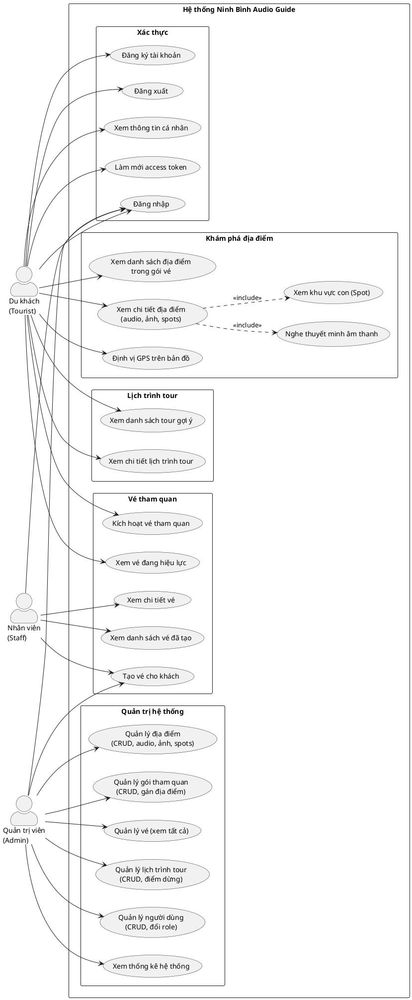
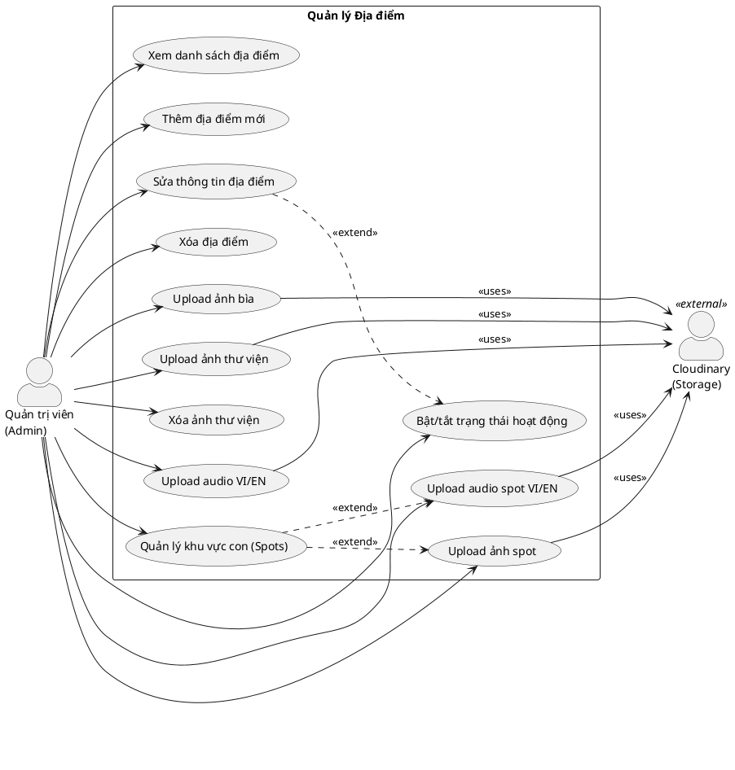
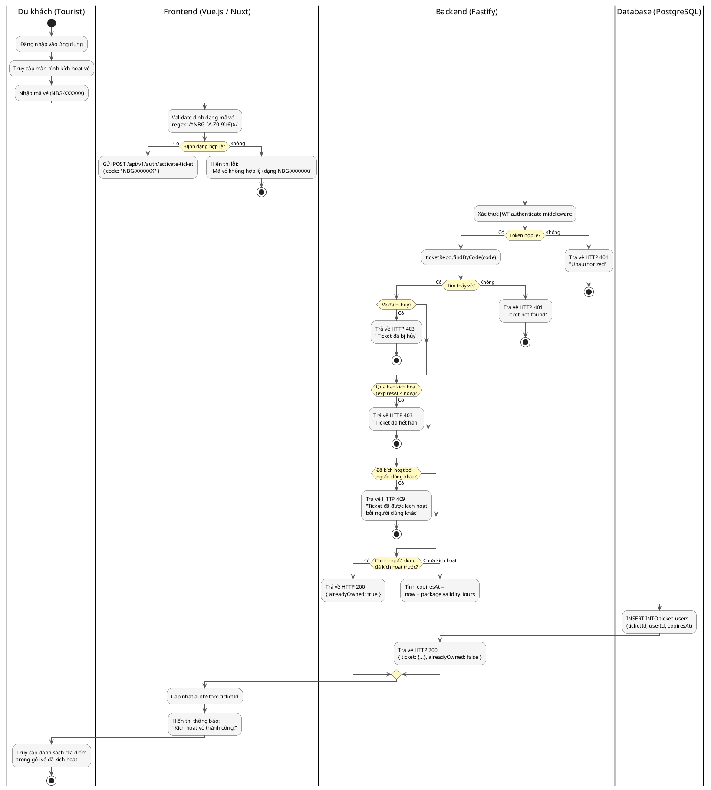
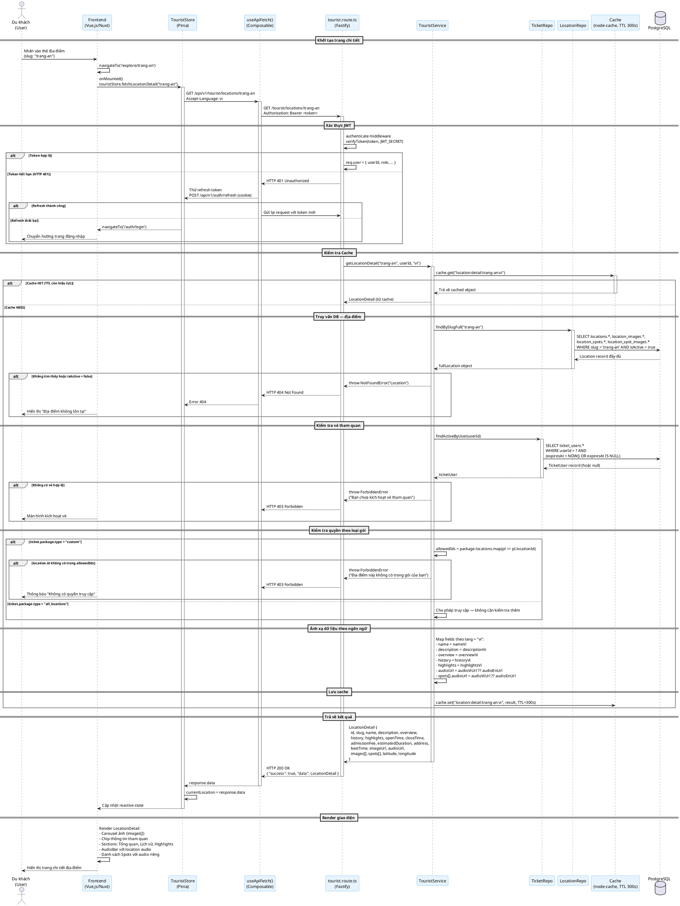
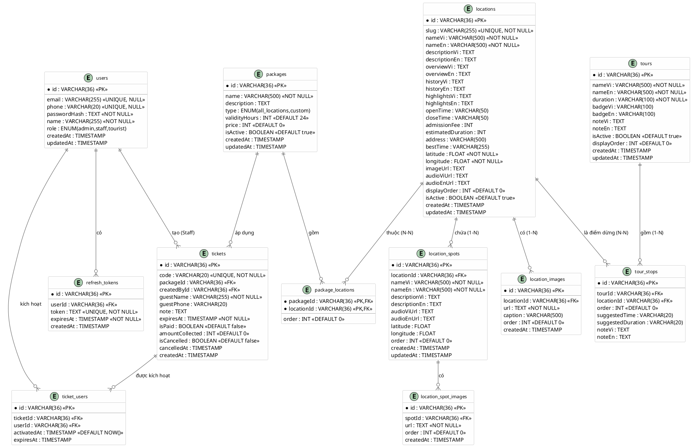

# CHƯƠNG 2: PHÂN TÍCH VÀ THIẾT KẾ HỆ THỐNG

---

## 2.1. Sơ đồ Use Case và Đặc tả kịch bản ngoại lệ

### 2.1.1. Sơ đồ Use Case tổng quan

Hệ thống **Ninh Bình Audio Guide** xác định ba tác nhân chính: **Du khách (Tourist)**, **Nhân viên quầy vé (Staff)** và **Quản trị viên (Admin)**. Mỗi tác nhân tương tác với hệ thống qua tập hợp các ca sử dụng đặc trưng, được mô tả trong sơ đồ dưới đây.

> [CHÈN ẢNH SƠ ĐỒ GEN TỪ MÃ PLANTUML PHÍA DƯỚI]



---

### 2.1.2. Sơ đồ Use Case chi tiết — Nhóm chức năng Quản lý địa điểm (Admin)

> [CHÈN ẢNH SƠ ĐỒ GEN TỪ MÃ PLANTUML PHÍA DƯỚI]



---

### 2.1.3. Đặc tả kịch bản ngoại lệ (Edge Cases)

#### Kịch bản 1: Du khách kích hoạt vé tham quan

| Thuộc tính | Mô tả |
|---|---|
| **Tên ca sử dụng** | Kích hoạt vé tham quan |
| **Tác nhân** | Du khách (Tourist) |
| **Điều kiện tiên quyết** | Người dùng đã đăng nhập và có access token hợp lệ |
| **Luồng bình thường** | Người dùng nhập mã NBG-XXXXXX → server xác thực → tạo TicketUser → trả về thông tin gói |

**Kịch bản ngoại lệ E1.1 — Mã vé không tồn tại trong hệ thống:**

```
1. Du khách gửi POST /api/v1/auth/activate-ticket với { code: "NBG-XXXXXX" }
2. Zod validate format: /^NBG-[A-Z0-9]{6}$/ — hợp lệ về cú pháp
3. ticketRepo.findByCode("NBG-XXXXXX") trả về null
4. TicketService ném NotFoundError("Ticket")
5. Global error handler trả về:
   HTTP 404 Not Found
   { "success": false, "error": { "code": "NOT_FOUND", "message": "Ticket not found" } }
6. Frontend hiển thị thông báo: "Mã vé không hợp lệ. Vui lòng kiểm tra lại."
```

**Kịch bản ngoại lệ E1.2 — Vé đã bị hủy:**

```
1. Du khách nhập mã vé hợp lệ
2. ticketRepo.findByCode() trả về ticket với isCancelled = true
3. TicketService ném ForbiddenError("Ticket đã bị hủy")
4. Server trả về:
   HTTP 403 Forbidden
   { "success": false, "error": { "code": "FORBIDDEN", "message": "Ticket đã bị hủy" } }
```

**Kịch bản ngoại lệ E1.3 — Vé đã quá hạn kích hoạt (30 ngày):**

```
1. Du khách nhập mã vé có ticket.expiresAt < now()
2. TicketService kiểm tra: ticket.expiresAt < new Date()
3. Ném ForbiddenError("Ticket đã hết hạn")
4. Server trả về:
   HTTP 403 Forbidden
   { "success": false, "error": { "code": "FORBIDDEN", "message": "Ticket đã hết hạn" } }
```

**Kịch bản ngoại lệ E1.4 — Vé đã được kích hoạt bởi người dùng khác:**

```
1. Vé đã có TicketUser với userId khác với người dùng hiện tại
2. alreadyActivated = ticket.ticketUsers.find(tu => tu.userId !== userId)
3. Ném ConflictError("Ticket đã được kích hoạt bởi người dùng khác")
4. Server trả về:
   HTTP 409 Conflict
   { "success": false, "error": { "code": "CONFLICT",
     "message": "Ticket đã được kích hoạt bởi người dùng khác" } }
```

**Kịch bản ngoại lệ E1.5 — Kích hoạt lại vé của chính mình (idempotent):**

```
1. Du khách nhập lại mã vé đã kích hoạt từ trước
2. selfActivated = ticket.ticketUsers.find(tu => tu.userId === userId) — tìm thấy
3. TicketService trả về { ticket, alreadyOwned: true } — không tạo bản ghi mới
4. Server trả về HTTP 200 với alreadyOwned = true
5. Frontend hiển thị thông báo: "Vé đã được kích hoạt trước đó."
```

---

#### Kịch bản 2: Admin tạo địa điểm mới với dữ liệu không hợp lệ

| Thuộc tính | Mô tả |
|---|---|
| **Tên ca sử dụng** | Thêm địa điểm mới |
| **Tác nhân** | Quản trị viên (Admin) |
| **Điều kiện tiên quyết** | Admin đã đăng nhập và có access token với role = admin |

**Kịch bản ngoại lệ E2.1 — Thiếu trường bắt buộc hoặc tọa độ ngoài giới hạn:**

```
Frontend (client-side):
1. Admin nhấn "Lưu" khi latitude/longitude để trống
2. Form validate: các trường bắt buộc chưa được điền
3. Hiển thị lỗi inline, request không được gửi

Backend (server-side — lớp bảo vệ thứ hai):
4. Nếu request đến server với latitude = 200:
   CreateLocationSchema: z.number().min(-90).max(90) thất bại
5. safeParse() trả về { success: false, error: ZodError }
6. Route handler ném ValidationError("Validation failed", parsed.error.flatten())
7. Server trả về:
   HTTP 422 Unprocessable Entity
   { "success": false, "error": { "code": "VALIDATION_ERROR",
     "details": { "fieldErrors": { "latitude": ["Number must be less than or equal to 90"] } } } }
```

**Kịch bản ngoại lệ E2.2 — Slug chứa ký tự không hợp lệ:**

```
1. Admin nhập slug "Trang An" (có khoảng trắng và chữ hoa)
2. Zod validate: z.string().regex(/^[a-z0-9-]+$/) thất bại
3. Server trả về lỗi validation với message:
   "Slug must contain only lowercase letters, numbers and hyphens"
```

**Kịch bản ngoại lệ E2.3 — Slug đã tồn tại trong hệ thống:**

```
1. Admin nhập slug "trang-an" đã tồn tại
2. LocationService gọi locationRepo.findBySlug("trang-an")
3. Tìm thấy bản ghi → ném ConflictError("Slug 'trang-an' already exists")
4. Server trả về:
   HTTP 409 Conflict
   { "success": false, "error": { "code": "CONFLICT",
     "message": "Slug 'trang-an' already exists" } }
```

---

#### Kịch bản 3: Du khách xem chi tiết địa điểm không có trong gói vé

| Thuộc tính | Mô tả |
|---|---|
| **Tên ca sử dụng** | Xem chi tiết địa điểm |
| **Tác nhân** | Du khách (Tourist) |
| **Điều kiện tiên quyết** | Du khách đã đăng nhập và đã kích hoạt vé |

**Kịch bản ngoại lệ E3.1 — Chưa kích hoạt vé:**

```
1. Du khách gửi GET /api/v1/tourist/locations/trang-an
2. TouristService gọi ticketRepo.findActiveByUser(userId)
3. Không tìm thấy TicketUser hoặc đã hết hạn → trả về null
4. Ném ForbiddenError("Bạn chưa kích hoạt vé tham quan")
5. Server trả về:
   HTTP 403 Forbidden
   { "success": false, "error": { "code": "FORBIDDEN",
     "message": "Bạn chưa kích hoạt vé tham quan" } }
6. Frontend chuyển hướng đến màn hình kích hoạt vé
```

**Kịch bản ngoại lệ E3.2 — Địa điểm không thuộc gói custom của du khách:**

```
1. Du khách có vé với package.type = "custom"
2. allowedIds = ticket.package.locations.map(pl => pl.locationId)
3. location.id không có trong allowedIds
4. Ném ForbiddenError("Địa điểm này không có trong gói của bạn")
5. Server trả về HTTP 403 Forbidden
```

**Kịch bản ngoại lệ E3.3 — Vé hết hạn sử dụng (TicketUser.expiresAt):**

```
1. Du khách có TicketUser nhưng expiresAt < now()
2. ticketRepo.findActiveByUser kiểm tra:
   WHERE expiresAt > NOW() OR expiresAt IS NULL
3. Không tìm thấy bản ghi hợp lệ → trả về null
4. Ném ForbiddenError("Bạn chưa kích hoạt vé tham quan")
```

**Kịch bản ngoại lệ E3.4 — JWT hết hạn (access token 1 giờ):**

```
1. Frontend gửi request với access token hết hạn
2. authenticate middleware gọi verifyToken() → ném UnauthorizedError
3. Server trả về HTTP 401 Unauthorized
4. Frontend (useApiFetch composable) bắt lỗi 401
5. Tự động gửi POST /api/v1/auth/refresh (cookie refreshToken)
6. Nếu refresh thành công → gửi lại request gốc với token mới
7. Nếu refresh thất bại → chuyển hướng đến /auth/login
```

---

## 2.2. Sơ đồ luồng nghiệp vụ (Activity Diagram)

### 2.2.1. Luồng "Kích hoạt vé tham quan"

Sơ đồ hoạt động mô tả chi tiết quy trình từ khi du khách nhập mã vé đến khi hệ thống xác nhận kích hoạt thành công, bao gồm các nhánh xử lý lỗi.

> [CHÈN ẢNH SƠ ĐỒ GEN TỪ MÃ PLANTUML PHÍA DƯỚI]



---

## 2.3. Sơ đồ tuần tự (Sequence Diagram)

### 2.3.1. Luồng "Xem chi tiết địa điểm"

Sơ đồ tuần tự mô tả luồng tương tác theo chiều dọc thời gian giữa các thành phần hệ thống khi du khách truy cập trang chi tiết một địa điểm tham quan, bao gồm cơ chế cache và kiểm tra quyền truy cập.

> [CHÈN ẢNH SƠ ĐỒ GEN TỪ MÃ PLANTUML PHÍA DƯỚI]



---

## 2.4. Thiết kế Cơ sở dữ liệu (Database Design)

### 2.4.1. Sơ đồ ERD (Entity Relationship Diagram)

> [CHÈN ẢNH SƠ ĐỒ GEN TỪ MÃ PLANTUML PHÍA DƯỚI]



---

### 2.4.2. Đặc tả chi tiết các bảng cơ sở dữ liệu

#### Bảng `users` — Người dùng hệ thống

| STT | Tên cột | Kiểu dữ liệu | Ràng buộc | Mô tả |
|-----|---------|-------------|-----------|-------|
| 1 | `id` | VARCHAR(36) | PRIMARY KEY | Định danh duy nhất (cuid) |
| 2 | `email` | VARCHAR(255) | UNIQUE, NULL | Địa chỉ email đăng nhập |
| 3 | `phone` | VARCHAR(20) | UNIQUE, NULL | Số điện thoại đăng nhập |
| 4 | `passwordHash` | TEXT | NOT NULL | Mật khẩu đã mã hóa (bcrypt, 12 rounds) |
| 5 | `name` | VARCHAR(255) | NOT NULL | Họ tên đầy đủ |
| 6 | `role` | ENUM | NOT NULL, DEFAULT 'tourist' | Vai trò: admin / staff / tourist |
| 7 | `createdAt` | TIMESTAMP | DEFAULT NOW() | Thời điểm tạo tài khoản |
| 8 | `updatedAt` | TIMESTAMP | AUTO UPDATE | Thời điểm cập nhật lần cuối |

> **Ràng buộc nghiệp vụ**: Người dùng phải có ít nhất một trong hai trường `email` hoặc `phone` khác null. Trường `passwordHash` không bao giờ được trả về trong API response.

---

#### Bảng `locations` — Địa điểm tham quan

| STT | Tên cột | Kiểu dữ liệu | Ràng buộc | Mô tả |
|-----|---------|-------------|-----------|-------|
| 1 | `id` | VARCHAR(36) | PRIMARY KEY | Định danh duy nhất (cuid) |
| 2 | `slug` | VARCHAR(255) | UNIQUE, NOT NULL | Định danh URL thân thiện — chỉ chứa a-z, 0-9, dấu gạch ngang |
| 3 | `nameVi` | VARCHAR(500) | NOT NULL | Tên địa điểm tiếng Việt |
| 4 | `nameEn` | VARCHAR(500) | NOT NULL | Tên địa điểm tiếng Anh |
| 5 | `descriptionVi` | TEXT | NULL | Mô tả ngắn tiếng Việt (hiển thị trong danh sách) |
| 6 | `descriptionEn` | TEXT | NULL | Mô tả ngắn tiếng Anh |
| 7 | `overviewVi` | TEXT | NULL | Tổng quan tiếng Việt (chi tiết) |
| 8 | `overviewEn` | TEXT | NULL | Tổng quan tiếng Anh |
| 9 | `historyVi` | TEXT | NULL | Lịch sử hình thành tiếng Việt |
| 10 | `historyEn` | TEXT | NULL | Lịch sử hình thành tiếng Anh |
| 11 | `highlightsVi` | TEXT | NULL | Điểm nổi bật tiếng Việt |
| 12 | `highlightsEn` | TEXT | NULL | Điểm nổi bật tiếng Anh |
| 13 | `openTime` | VARCHAR(50) | NULL | Giờ mở cửa |
| 14 | `closeTime` | VARCHAR(50) | NULL | Giờ đóng cửa |
| 15 | `admissionFee` | INT | NULL | Giá vé tham quan (VND) |
| 16 | `estimatedDuration` | INT | NULL | Thời gian tham quan ước tính (phút) |
| 17 | `address` | VARCHAR(500) | NULL | Địa chỉ đầy đủ |
| 18 | `bestTime` | VARCHAR(255) | NULL | Thời điểm lý tưởng để tham quan |
| 19 | `latitude` | FLOAT | NOT NULL | Vĩ độ GPS — khoảng [-90, 90] |
| 20 | `longitude` | FLOAT | NOT NULL | Kinh độ GPS — khoảng [-180, 180] |
| 21 | `imageUrl` | TEXT | NULL | URL ảnh bìa (Cloudinary) |
| 22 | `audioViUrl` | TEXT | NULL | URL file audio thuyết minh tiếng Việt (MP3) |
| 23 | `audioEnUrl` | TEXT | NULL | URL file audio thuyết minh tiếng Anh (MP3) |
| 24 | `displayOrder` | INT | DEFAULT 0 | Thứ tự hiển thị trên bản đồ và danh sách |
| 25 | `isActive` | BOOLEAN | DEFAULT true | Trạng thái kích hoạt |
| 26 | `createdAt` | TIMESTAMP | DEFAULT NOW() | Thời điểm tạo |
| 27 | `updatedAt` | TIMESTAMP | AUTO UPDATE | Thời điểm cập nhật |

> **Fallback audio**: Khi truy xuất theo ngôn ngữ, nếu audioViUrl là null thì dùng audioEnUrl (và ngược lại). Logic này áp dụng cho cả location lẫn location_spots.

---

#### Bảng `tickets` — Vé tham quan

| STT | Tên cột | Kiểu dữ liệu | Ràng buộc | Mô tả |
|-----|---------|-------------|-----------|-------|
| 1 | `id` | VARCHAR(36) | PRIMARY KEY | Định danh duy nhất |
| 2 | `code` | VARCHAR(20) | UNIQUE, NOT NULL | Mã vé định dạng NBG-XXXXXX (6 ký tự, bỏ I/O/0/1 dễ nhầm) |
| 3 | `packageId` | VARCHAR(36) | FOREIGN KEY, NOT NULL | Gói tham quan áp dụng |
| 4 | `createdById` | VARCHAR(36) | FOREIGN KEY, NOT NULL | Nhân viên tạo vé (users.id, role = staff hoặc admin) |
| 5 | `guestName` | VARCHAR(255) | NOT NULL | Tên khách tham quan |
| 6 | `guestPhone` | VARCHAR(20) | NULL | Số điện thoại khách (9-15 ký tự) |
| 7 | `note` | TEXT | NULL | Ghi chú của nhân viên (tối đa 500 ký tự) |
| 8 | `expiresAt` | TIMESTAMP | NOT NULL | Hạn cuối để kích hoạt (30 ngày từ ngày tạo) |
| 9 | `isPaid` | BOOLEAN | DEFAULT false | Trạng thái đã thu tiền |
| 10 | `amountCollected` | INT | DEFAULT 0 | Số tiền đã thu (VND) |
| 11 | `isCancelled` | BOOLEAN | DEFAULT false | Trạng thái hủy vé |
| 12 | `cancelledAt` | TIMESTAMP | NULL | Thời điểm hủy vé |
| 13 | `createdAt` | TIMESTAMP | DEFAULT NOW() | Thời điểm tạo vé |

> **Lưu ý**: `expiresAt` ở bảng `tickets` là hạn kích hoạt (tối đa 30 ngày từ lúc tạo), khác với `expiresAt` ở bảng `ticket_users` là hạn sử dụng (tính từ lúc kích hoạt + `package.validityHours`).

---

#### Bảng `ticket_users` — Kích hoạt vé

| STT | Tên cột | Kiểu dữ liệu | Ràng buộc | Mô tả |
|-----|---------|-------------|-----------|-------|
| 1 | `id` | VARCHAR(36) | PRIMARY KEY | Định danh duy nhất |
| 2 | `ticketId` | VARCHAR(36) | FOREIGN KEY, NOT NULL | Vé được kích hoạt |
| 3 | `userId` | VARCHAR(36) | FOREIGN KEY, NOT NULL | Du khách kích hoạt |
| 4 | `activatedAt` | TIMESTAMP | DEFAULT NOW() | Thời điểm kích hoạt |
| 5 | `expiresAt` | TIMESTAMP | NULL | Hạn sử dụng (= activatedAt + package.validityHours) |

> **Ràng buộc nghiệp vụ**: UNIQUE(ticketId, userId) — mỗi cặp vé-tài khoản chỉ có một bản ghi. Một vé chỉ được kích hoạt bởi một tài khoản duy nhất (ConflictError nếu có người khác kích hoạt trước). Khi `expiresAt IS NULL` (legacy), vé được coi là còn hiệu lực vĩnh viễn.

---

#### Bảng `tours` — Lịch trình tour gợi ý

| STT | Tên cột | Kiểu dữ liệu | Ràng buộc | Mô tả |
|-----|---------|-------------|-----------|-------|
| 1 | `id` | VARCHAR(36) | PRIMARY KEY | Định danh duy nhất |
| 2 | `nameVi` | VARCHAR(500) | NOT NULL | Tên lịch trình tiếng Việt |
| 3 | `nameEn` | VARCHAR(500) | NOT NULL | Tên lịch trình tiếng Anh |
| 4 | `duration` | VARCHAR(100) | NOT NULL | Thời gian ước tính (VD: "1 ngày", "2 ngày 1 đêm") |
| 5 | `badgeVi` | VARCHAR(100) | NULL | Nhãn phân loại tiếng Việt (VD: "Phổ biến") |
| 6 | `badgeEn` | VARCHAR(100) | NULL | Nhãn phân loại tiếng Anh |
| 7 | `noteVi` | TEXT | NULL | Ghi chú/lưu ý tiếng Việt |
| 8 | `noteEn` | TEXT | NULL | Ghi chú/lưu ý tiếng Anh |
| 9 | `isActive` | BOOLEAN | DEFAULT true | Trạng thái hiển thị cho du khách |
| 10 | `displayOrder` | INT | DEFAULT 0 | Thứ tự hiển thị |
| 11 | `createdAt` | TIMESTAMP | DEFAULT NOW() | Thời điểm tạo |
| 12 | `updatedAt` | TIMESTAMP | AUTO UPDATE | Thời điểm cập nhật |

---

### 2.4.3. Tổng hợp quan hệ giữa các bảng

| Quan hệ | Loại | Mô tả |
|---------|------|-------|
| users → refresh_tokens | 1-N | Một tài khoản có nhiều refresh token (xóa cascade khi xóa user) |
| users → tickets | 1-N | Một nhân viên tạo nhiều vé cho các khách khác nhau |
| users → ticket_users | 1-N | Một du khách có thể kích hoạt nhiều vé (nhưng mỗi thời điểm chỉ 1 vé hiệu lực) |
| locations → location_images | 1-N | Một địa điểm có nhiều ảnh trong thư viện (xóa cascade) |
| locations → location_spots | 1-N | Một địa điểm có nhiều khu vực con, mỗi khu vực có audio và ảnh riêng |
| locations → package_locations | N-N | Một địa điểm có thể thuộc nhiều gói tham quan (qua bảng trung gian) |
| locations → tour_stops | N-N | Một địa điểm có thể là điểm dừng của nhiều lịch trình tour |
| location_spots → location_spot_images | 1-N | Một khu vực con có nhiều ảnh (xóa cascade) |
| packages → package_locations | 1-N | Một gói gồm nhiều địa điểm (gói custom) |
| packages → tickets | 1-N | Một gói được áp dụng cho nhiều vé |
| tickets → ticket_users | 1-N | Một vé chỉ được kích hoạt bởi đúng một tài khoản (ràng buộc nghiệp vụ) |
| tours → tour_stops | 1-N | Một lịch trình tour gồm nhiều điểm dừng có thứ tự (xóa cascade) |

---

## 2.5. Đặc tả xử lý ngoại lệ theo nghiệp vụ thực tế

### 2.5.1. Validation dữ liệu đầu vào — `CreateLocationSchema`

Bảng sau mô tả các ràng buộc Zod được áp dụng khi tạo mới địa điểm:

| Trường | Ràng buộc Zod | Lỗi khi vi phạm |
|--------|--------------|-----------------|
| `nameVi` | `z.string().min(1)` | Trường này là bắt buộc |
| `nameEn` | `z.string().min(1)` | Trường này là bắt buộc |
| `slug` | `z.string().regex(/^[a-z0-9-]+$/)` | "Slug must contain only lowercase letters, numbers and hyphens" |
| `latitude` | `z.number().min(-90).max(90)` | "Number must be greater than or equal to -90" / "less than or equal to 90" |
| `longitude` | `z.number().min(-180).max(180)` | "Number must be greater than or equal to -180" / "less than or equal to 180" |

`UpdateLocationSchema` là `CreateLocationSchema.partial()` được extend thêm `isActive: z.boolean().optional()` và các trường nội dung (overview, history, highlights, openTime, closeTime, admissionFee, estimatedDuration, address, bestTime).

### 2.5.2. Luồng kích hoạt vé — `activateTicket()`

Thứ tự kiểm tra trong `TicketService.activateTicket()`:

1. `ticketRepo.findByCode(code)` — null → NotFoundError (HTTP 404)
2. `ticket.isCancelled` — true → ForbiddenError (HTTP 403)
3. `ticket.expiresAt < new Date()` — true → ForbiddenError (HTTP 403)
4. `ticket.ticketUsers.find(tu => tu.userId !== userId)` — tìm thấy → ConflictError (HTTP 409)
5. `ticket.ticketUsers.find(tu => tu.userId === userId)` — tìm thấy → return `{ ticket, alreadyOwned: true }` (idempotent)
6. Tạo `TicketUser` với `expiresAt = now + package.validityHours * 3600 * 1000`

### 2.5.3. Kiểm tra vé hiệu lực — `findActiveByUser()`

```sql
SELECT * FROM ticket_users
  JOIN tickets ON ticket_users.ticketId = tickets.id
  JOIN packages ON tickets.packageId = packages.id
WHERE ticket_users.userId = ?
  AND (ticket_users.expiresAt > NOW() OR ticket_users.expiresAt IS NULL)
LIMIT 1
```

Điều kiện `expiresAt IS NULL` dành cho các bản ghi legacy (tạo ra trước khi hệ thống tính `expiresAt` tự động) — những vé này được coi là còn hiệu lực vĩnh viễn.

### 2.5.4. Upload file — Cloudinary

| Tham số | Giá trị | Ghi chú |
|---------|---------|---------|
| Giới hạn kích thước | 50 MB | Cấu hình tại `@fastify/multipart` trong `app.ts` |
| Loại storage | Cloudinary (free tier) | Dùng cho cả audio MP3 và ảnh JPG/PNG |
| Endpoint audio location | `POST /admin/locations/:id/audio?lang=vi\|en` | Upload audio chính của địa điểm |
| Endpoint audio spot | `POST /admin/locations/:id/spots/:spotId/audio?lang=vi\|en` | Upload audio khu vực con |
| Endpoint ảnh bìa | `POST /admin/locations/:id/image` | Cập nhật `imageUrl` của location |
| Endpoint ảnh thư viện | `POST /admin/locations/:id/images` | Thêm vào bảng `location_images` |
| Kiểm tra credentials | `assertCloudinaryConfigured()` | Throw Error ngay nếu env chưa cấu hình |

### 2.5.5. JWT và refresh token

| Thông số | Giá trị | Ghi chú |
|----------|---------|---------|
| Access token TTL | 1 giờ | Gửi trong header `Authorization: Bearer <token>` |
| Refresh token TTL | 7 ngày | Lưu trong httpOnly cookie (`refreshToken`) |
| Cookie SameSite (production) | `None` + `Secure=true` | Cho phép cross-domain Railway ↔ Vercel |
| Cookie SameSite (development) | `Lax` | HTTP localhost không cần Secure |
| Rate limit login | 5 lần / 15 phút | Cấu hình trên endpoint `POST /auth/login` |
| Auto-refresh | Có | `useApiFetch` bắt 401, gọi `/auth/refresh`, thử lại |
| Bảo mật login fail | HTTP 401 (không phân biệt) | Không trả 404 khi email không tồn tại — tránh user enumeration |
